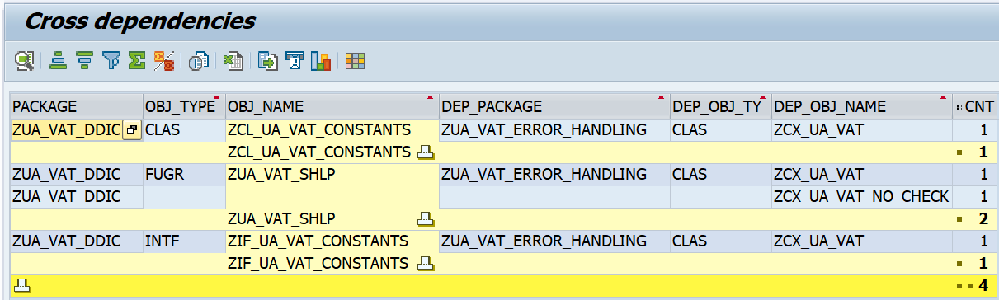

# Crossdeps

## Features
- finds crossdeps between custom packages
- finds deep dependencies (so including dependencies of dependencies) of a given object

## Attribution
- reuses some of this: https://github.com/larshp/dependencies
- and some parts of [abapGit tadir class](https://github.com/abapGit/abapGit/blob/main/src/objects/core/zcl_abapgit_tadir.clas.abap)
